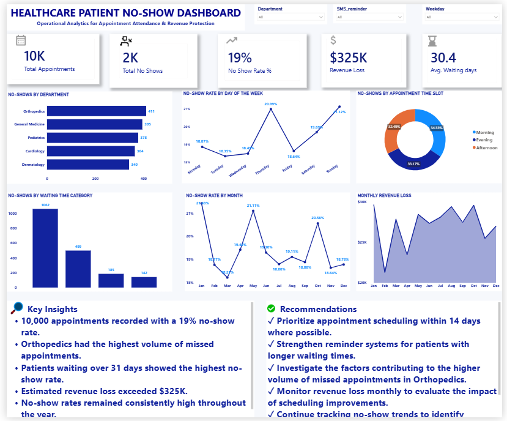

**Healthcare Patient No-Show Optimization**

**Project Overview**

Healthcare organizations face significant operational and financial challenges when patients miss scheduled appointments. Missed appointments reduce provider utilization, increase waiting times, delay access to care, and result in avoidable revenue loss.

This project demonstrates how Healthcare Business Intelligence can be used to identify patient no-show patterns, quantify their operational and financial impact, and generate data-driven recommendations that support hospital decision-making.

Using SQL for data analysis and Power BI for interactive reporting, the project explores the key drivers of missed appointments across departments, waiting times, appointment schedules, and patient characteristics.

**Business Problem**

Hospitals need to understand:

Which patients are most likely to miss appointments?

Which operational factors contribute to higher no-show rates?

Which departments are most financially affected?

How effective are appointment reminder systems?

Which interventions could reduce future no-shows?

This analysis provides insights that support operational planning, resource allocation, and revenue protection.

**Business Questions**

This project answers the following business questions:

What is the overall patient no-show rate?

Which departments experience the highest volume of missed appointments?

What is the estimated revenue loss caused by no-shows?

How do waiting times influence appointment attendance?

Do SMS reminders reduce patient no-show rates?

Which appointment time slots experience the highest number of no-shows?

How do no-show rates vary across weekdays and months?

**Dataset**

The project uses four relational datasets representing a simplified hospital appointment system.

**Table	Description**

Patient:	Patient demographics and insurance information

Doctor:	Physician details and department assignments

Appointment:	Appointment scheduling, attendance, waiting time and reminder information

Billing:	Appointment costs and estimated financial losses

**Tools & Technologies**

Microsoft Excel
MySQL
Power BI
DAX
Git & GitHub

**Project Workflow**

Raw Data (Excel)
        │
        ▼
Data Cleaning
        │
        ▼
MySQL Database
        │
        ▼
SQL Business Analysis
        │
        ▼
Power BI Data Model
        │
        ▼
DAX Measures
        │
        ▼
Interactive Dashboard
        │
        ▼
Business Insights & Recommendations

**Dashboard Overview**

The interactive Power BI dashboard includes:

Executive KPI summary

No-show trends over time

Department performance

Revenue loss analysis

Waiting time analysis

Appointment time slot analysis

Interactive filtering by department, gender, insurance status and waiting category

**Key Findings**

**Appointment Performance**

Total Appointments: 9,725

Total No-Shows: 1,888

Overall No-Show Rate: 19.41%

**Operational Insights**

Orthopedics recorded the highest number of missed appointments.

Patients waiting more than 31 days showed the highest no-show rate.

No-show rates remained relatively consistent throughout the year, indicating an ongoing operational challenge.

**Financial Impact**

Estimated Revenue Loss: $325,089

Missed appointments resulted in substantial financial losses across hospital departments.

**SMS Reminder Analysis**

Patients receiving SMS reminders demonstrated substantially lower no-show rates than patients who did not receive reminders, highlighting the value of proactive appointment communication.

**Business Recommendations**

Expand SMS reminder coverage to improve appointment attendance.

Reduce long appointment waiting times where operationally feasible.

Prioritize intervention strategies for departments with consistently high no-show volumes.

Monitor appointments scheduled more than 30 days in advance and consider follow-up reminder workflows.

## Dashboard Preview

### Executive Dashboard

**Repository Structure**

Healthcare-Patient-No-Show-Optimization
│
├── data/
├── sql/
│   ├── database.sql
│   └── business_queries.sql
│
├── powerbi/
│   └── Patient_No_Show.pbix
│
├── dashboard/
│   └── dashboard.png
│
├── README.md
└── LICENSE

**Skills Demonstrated**

This project demonstrates practical experience in:

Healthcare Business Intelligence

SQL querying

Relational database design

Data cleaning

KPI development

DAX calculations

Interactive dashboard development

Business storytelling

Executive reporting

**Author**

Adeniyi Tijesunimi

Aspiring Healthcare Business Intelligence Analyst

📌 LinkedIn: http://www.linkedin.com/in/adeniyitijesunimi

📌 Portfolio:https://invincible-slash-579.notion.site/ADENIYI-TIJESUNIMI-6e6d2fbaf62d8386880781d2a25240f5?pvs=73
